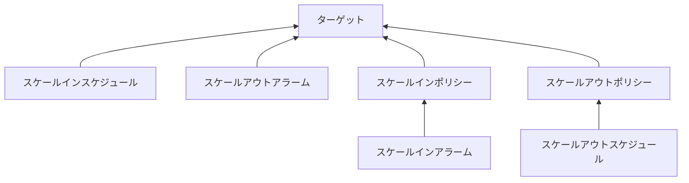

import Tabs from "@theme/Tabs";
import TabItem from "@theme/TabItem";
import Typography from "@mui/material/Typography";
import IconButton from '@mui/material/IconButton';
import Tooltip from '@mui/material/Tooltip';
import ErrorOutlineIcon from '@mui/icons-material/ErrorOutline';
import InfoIcon from '@mui/icons-material/Info';
import Button from '@mui/material/Button';
import JobPosting from '@site/src/components/JobPosting';


[Application Auto Scaling とは](https://docs.aws.amazon.com/ja_jp/autoscaling/application/userguide/what-is-application-auto-scaling.html)AWSドキュメントでは以下のように説明されています。

> Application Auto Scaling は、Amazon EC2 以外の個々のサービス用にスケーラブルなリソースを自動的にスケーリングするソリューションを必要とするデベロッパーやシステム管理者向けのウェブ AWS サービスです。Application Auto Scaling では、次のリソースの自動スケーリングを設定できます。

私は違いが分かっておらず勘違いしておりましたが、普通のAuto Scalingとは別物のようです。このサービスはコンソールから見えないものがあるとのこと。

> リソースにはコンソールアクセスを利用できないものもあります。詳細については、「[AWS のサービス Application Auto Scaling で使用できる](https://docs.aws.amazon.com/ja_jp/autoscaling/application/userguide/integrated-services-list.html)」を参照してください。

[リンク先](https://docs.aws.amazon.com/ja_jp/autoscaling/application/userguide/integrated-services-list.html)では、Amazon ECSのコンソールアクセスは〇になっていますが、すべて見えるかというとそんなことありませんでした。。

{/* truncate */}

## Application Auto Scalingの設定

CLIでもできますがTerraformで設定していきます。（CLIだとコンソールにも表示されないため管理しずらそうです）

まずは、ECSのサービスを作成します。<Tooltip title="タスク定義は端折って、最小限の記載とします。" placement="top"><InfoIcon fontSize="medium"/></Tooltip>

```hcl
resource "aws_ecs_service" "test" {
  name                              = "test"
  cluster                           = aws_ecs_cluster.test.id
  task_definition                   = aws_ecs_task_definition.test.arn
  desired_count                     = 1

  {/* highlight-start */}
  lifecycle {
    ignore_changes = [desired_count]
  }
  {/* highlight-end */}
}
```

1つポイントを挙げるとすると`ignore_changes`で、これを設定しないとスケールアウトした際に、ずれるため無視するようにしています。

Application Auto Scalingは4要素で構成されています。

- ターゲット
- ポリシー
- アラーム
- スケジュール



ターゲットもサービス同様にスケーリングで変更される値は`ignore_changes`で無視しておくと無難でしょう。

```hcl
resource "aws_appautoscaling_target" "test" {
  service_namespace  = "ecs"
  resource_id        = "service/${aws_ecs_cluster.test.id}/${aws_ecs_service.test.name}"
  scalable_dimension = "ecs:service:DesiredCount"
  min_capacity       = 1
  max_capacity       = 4

  lifecycle {
    ignore_changes = [min_capacity]
  }
}
```

Application AutoScalingはECS以外でも利用できます。対象は`scalable_dimension`に設定しますが、[APIリファレンス](https://docs.aws.amazon.com/autoscaling/application/APIReference/API_PutScalingPolicy.html#API_PutScalingPolicy_RequestSyntax)に一覧があります。

### オートスケーリング

2分間で2つのデータポイントが平均CPU使用率が50%を超えていたら1台追加するように設定します。

```hcl
resource "aws_appautoscaling_policy" "test_fargate_scale_out" {
  name               = "test_fargate_scale_out"
  policy_type        = "StepScaling"
  service_namespace  = aws_appautoscaling_target.test.service_namespace
  resource_id        = aws_appautoscaling_target.test.resource_id
  scalable_dimension = aws_appautoscaling_target.test.scalable_dimension

  step_scaling_policy_configuration {
    adjustment_type         = "ChangeInCapacity"
    cooldown                = 60
    metric_aggregation_type = "Average"

    step_adjustment {
      metric_interval_lower_bound = 0
      scaling_adjustment          = 1
    }
  }
}

resource "aws_cloudwatch_metric_alarm" "test_fargate_scale_out" {
  alarm_name          = "test_ecs_cpu_utilization_high"
  comparison_operator = "GreaterThanOrEqualToThreshold"
  evaluation_periods  = "2"
  metric_name         = "CPUUtilization"
  namespace           = "AWS/ECS"
  period              = "60"
  statistic           = "Average"
  threshold           = "50"

  dimensions = {
    ClusterName = aws_ecs_cluster.test.name
    ServiceName = aws_ecs_service.test.name
  }

  alarm_actions = [
    aws_appautoscaling_policy.test_fargate_scale_out.arn
  ]
}
```

この例ではステップスケーリングポリシーを利用していますが、

`adjustment_type`には以下の値が利用できます。

- ChangeInCapacity - スケーラブルターゲットの現在の容量から、指定された値だけ増減します。
    - 例) 現在の容量が10で値が2の場合: 12
- ExactCapacity - スケーラブルターゲットの現在の容量を指定された値に変更します。
    - 例) 現在の容量が10で値が2の場合: 2
- PercentChangeInCapacity - スケーラブルターゲットの現在の容量を指定された割合だけ増減します。
    - 例) 現在の容量が10で値が10の場合: 11

[Scaling adjustment types](https://docs.aws.amazon.com/autoscaling/application/userguide/step-scaling-policy-overview.html#as-scaling-adjustment)

### スケジュール

cronで8時に最小・最大キャパシティを指定の値に変更します。（UTCであることに注意）

```hcl
resource "aws_appautoscaling_scheduled_action" "test_scale_out" {
  name               = "test_scale_out"
  service_namespace  = aws_appautoscaling_target.test.service_namespace
  resource_id        = aws_appautoscaling_target.test.resource_id
  scalable_dimension = aws_appautoscaling_target.test.scalable_dimension
  schedule           = "cron(0 23 * * ? *)"

  scalable_target_action {
    min_capacity = 2
    max_capacity = 4
  }
}
```

スケジュールはデフォルトで、ExactCapacityのような動作になります。

## さいごに

これでポリシーベースのスケーリングとスケジュールベースのスケーリングを組み合わせることで、負荷に応じてスケールしつつ夜間は稼働数を減らしたりとコストも配慮したスケーリングが実現できます。

<JobPosting/>
